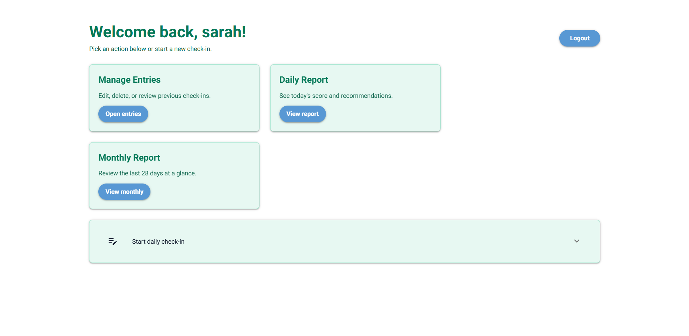
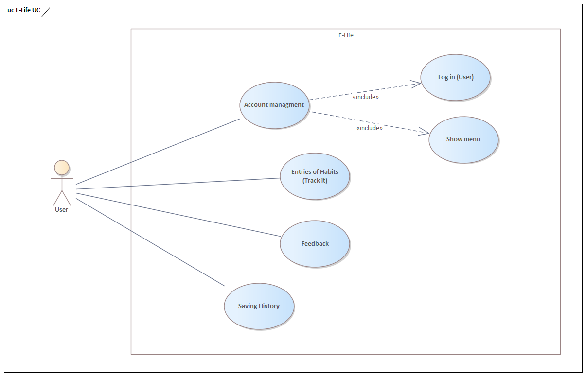
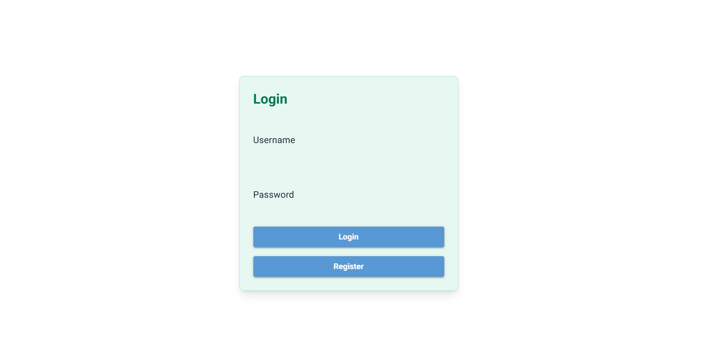
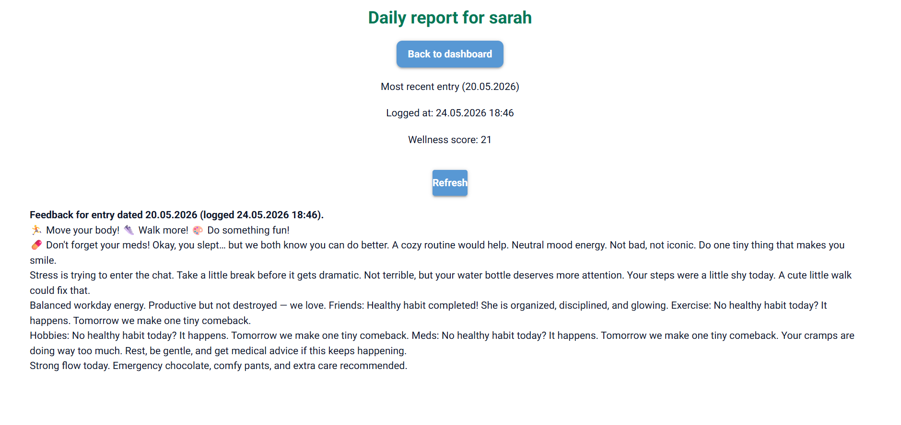
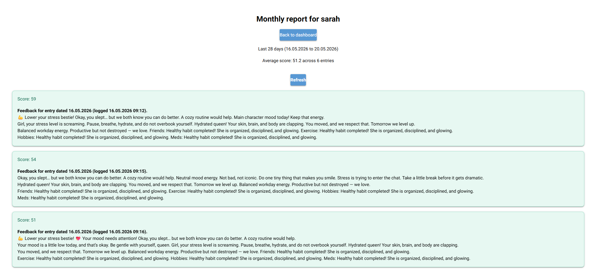
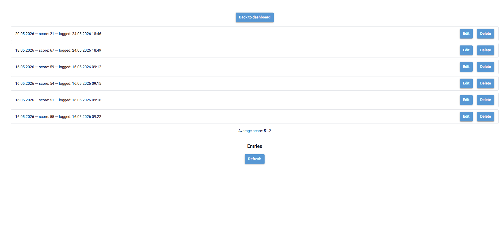
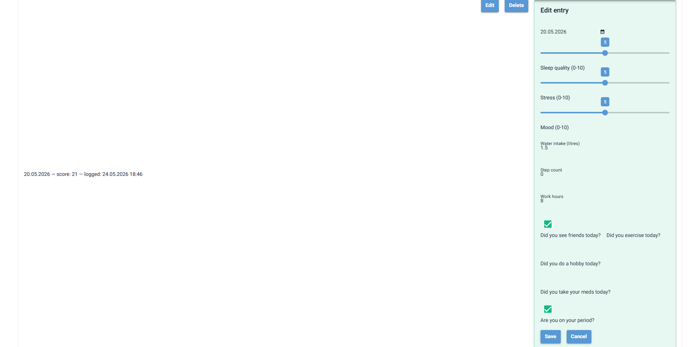
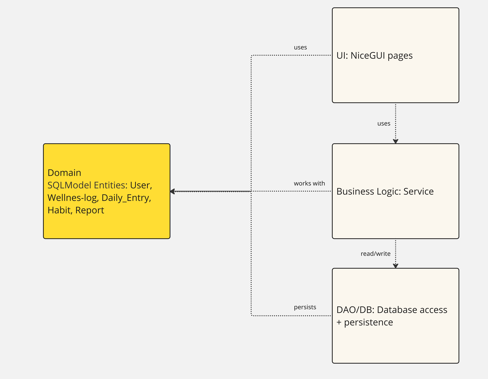
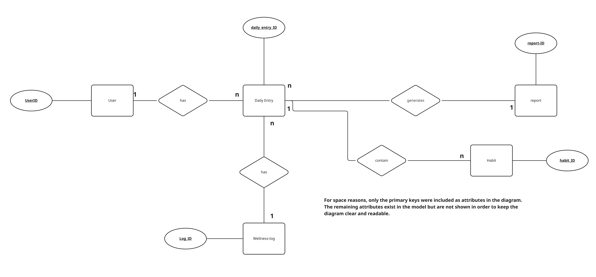

# E-LIF-E (Browser App)



---

This project demonstrates the development of a browser-based application using **NiceGUI**, focusing on clean architecture, data validation, and database integration via an ORM.

It aims to:

- Cover the full process from **requirements analysis to implementation**
- Apply advanced **Python** concepts in a web-based application
- Demonstrate **data validation**, layered architecture, and ORM usage
- Produce clean, maintainable, and well-tested code
- Support **teamwork and professional documentation**

---

## 📝 Application Requirements

### Problem

Users want to track their daily health habits (sleep, mood, stress, etc.), but without a structured system, it is difficult to evaluate and improve their lifestyle.

---

### Scenario

The application allows users to:

- enter daily health data (sleep, mood, stress, etc.) through simple input questions
- receive an automatically calculated wellness score (0–100) based on their inputs
- get personalized feedback and recommendations based on their score
- store daily entries in the system to track progress over time
- view daily, weekly, and monthly reports of their health data
- create an account and log in to access their personal data

---

## 📖 User Stories

### 1. Track Daily Habits 
**As a user, I want to answer simple daily questions in ≤ 60 seconds so that tracking is efficient.**

- **Inputs:** health data (see below)
- **Outputs:** feedback (according to the wellness score).

---

### 2. View Reports
**As a user, I want to receive daily, weekly, and monthly reports so that I can track my progress.**

- **Inputs:** stored data
- **Outputs:** aggregated report
 

---

### 3. Get Personalized Feedback
**As a user, I want to receive personalized advice based on my input so that I can improve my lifestyle.**

- **Inputs:** wellness score
- **Outputs:** recommendation text

---

### 4. Save History
**As a user, I want my data to be stored so that I can review past results.**

- **Inputs:**  

| Input              | Type  | Range / Validation        |
| ------------------ | ----- | ------------------------- |
| Username           | str   | length 3–20               |
| Sleep Quality      | int   | 0–10                      |
| Mood               | int   | 0–10                      |
| Stress             | int   | 0–10                      |
| Water Intake       | float | 0.0–5.0 liters            |
| Step Count         | int   | 0–50,000                  |
| Working Hours      | float | 0–16                      |
| Lifestyle (yes/no) | bool  | True / False              |
| Period Pain        | int   | 0–10                      |
| Period Flow        | int   | 1=low, 2=medium, 3=strong |

- **Outputs:** stored history


---

### 5. Account Management
**As a user, I want to create an account so that my data is personalized.**

- **Inputs:** username, password [String], [String]
- **Outputs:** account created [String]

As a User, I want to track my daily habits by answering simple, quick questions in not more than 1 minute in the app in order to be efficient.

---

### 6. Login
**As a user, I want to log in with my credentials so that I can access my data.**

- **Inputs:** username, password [String], [String]
- **Outputs:** access granted / denied [String]

I want to have an own account so that it would be personalised to my lifestyle or my habits.

---

## 🧩 Use Cases



- Enter Daily Health Data (User)
- Calculate Wellness Score (System)
- View Feedback (User)
- View Reports / History (User)
- Register Account (User)
- Login (User)
- Store Daily Entry (System)

### Actors
- User  
- System  

---

### Wireframes / Mockups

## Login



## Dashboard


## Report History



## Manage Entries



---

## 🏛️ Architecture



### Layers
- **UI:** NiceGUI (browser-based interface)  
- **Application logic:** controllers and services   ## Daily_Entry, Daily_Report, Dashboard, Login_Register, Monthly report.
- **Persistence:** SQLite + ORM + data access (DAO)  

### Design Decisions
- Layered architecture inspired by MVC (Model, UI Views, and controller-like page handlers)
- Partial separation of concerns via dedicated domain models, service logic, and DAO-based persistence
- Core wellness scoring logic implemented UI-agnostically in the service layer, while some flow and formatting logic remains in UI modules

### Patterns Used
- MVC  
- Repository / DAO    

---

## 🗄️ Database and ORM



The application uses **SQLModel** to map domain objects to a SQLite database.

### Entities
- `User`
- `Wellnes-log`
- `Daily_Entry`
- `Habit`
- `Report`

### Relationships
- One `User` → many `Daily_Entry`
- Each `Daily_Entry` has one `Wellness_log`
- One `Daily_Entry` contains many `Habit`
- One `Report` references many `Daily_Entry`

---


## ✅ Project Requirements

---

Each app must meet the following criteria in order to be accepted (see also the official project guidelines PDF on Moodle):

1. Using NiceGUI for building an interactive web app
2. Data validation in the app
3. Using an ORM for database management

---

### 1. Browser-based App (NiceGUI)


The application interacts with the user via the browser. Users can:

- Choose if the user wants to Login or Register (Create an Account )
- Enter Daily Check-in 
- See Daily Reports 
- See Monthly Reports 
- Logout  
- Delete and Edit Entry 
- Receive a Feedback 

**Architecture note (per SS26 guidelines):** the browser is a thin client; UI state + business logic live on the server-side NiceGUI app.

---

### 2. Data Validation

The application validates all user input to ensure data integrity and a smooth user experience.
These checks prevent crashes and guide the user to provide correct input, matching the validation requirements described in the project guidelines.

---

### 3. Database Management

All relevant data is managed via an ORM (e.g. SQLModel or SQLAlchemy). For the e-life app example this includes Users, Daily entries, Habit, Wellness_logic and report.

---

## ⚙️ Implementation

### Technology

- Python 3.11.15
- NiceGUI  
- SQLModel / SQLAlchemy  
- ReportLab  
- pytest  
- tzdata

---

### 📚 Libraries Used

- **nicegui** – UI framework  
- **sqlmodel** – ORM  
- **sqlalchemy** – database toolkit  
- **reportlab** – PDF generation  
- **python-dotenv** – configuration  
- **pytest** – testing  
- **pytest-cov** – coverage  

---

## 📂 Repository Structure

```text
elife_app/
├── data_access/
│   ├── __init__.py
│   ├── dao.py
│   ├── db.py
│   └── seed.py
|
├── domain/
│   ├── __init__.py
│   └── models.py
|
├── services/
│   ├── __init__.py
│   └── wellness_service.py
|
├── tests/
|   ├── conftest.py
|   ├── test_db.py
|   ├── test_integration.py
│   └── test_unit.py
|
└── ui/
│   ├── Daily_Entry.py
|   ├── Daily_Report.py
│   ├── Dashboard.py
│   ├── Login_Register.py
│   └── Monthly_Report.py
├── __init__.py
└── application.py
main.py

```
---

### How to Run


### 1. Project Setup
- Python 3.11.15 (or the course version) is required
- Create and activate a virtual environment:
   - **macOS/Linux:**
      ```bash
      python3 -m venv .venv
      source .venv/bin/activate
      ```
   - **Windows:**
      ```bash
      python -m venv .venv
      .venv\Scripts\Activate
      ```
- Install dependencies:
   ```bash
   pip install -r requirements.txt
   ```

### 2. Configuration **
- E.g., setup of parameters or environment variables

### 3. Launch
- Start the NiceGUI app (example):
   ```bash
   py -m elife_app
   ```
- Open the URL printed in the console.

### 4. Usage (document as steps)


Record Daily Entry: 
1. Log into Account 
2. Choose “Start daily check-in” to record Today’s Entry 
3. Fill out Entry  
4. Submit Check-in 
5. Receive a Feedback/Advise  


> 🚧 Add UI screenshots of the main screens (or a short video link):

Demo video (hosted): https://youtu.be/REPLACE_WITH_YOUR_VIDEO_ID

> Tip: Upload the demo as **Unlisted** on YouTube so everyone with the link can watch it.

---

## 🧪 Testing


|-----------------------------|-------------------------------------------------------------------------------------------------------------------------------------|
| Field                       | Details                                                                                                                             |
|-----------------------------|-------------------------------------------------------------------------------------------------------------------------------------|
| Test case ID                | TC_001                                                                                                                              |
| Test case title/description |  Verifies seeded data can be found and displayed.                                                                                   |
|                             |                                                                                                                                     |
| Preconditions               | -          User has an account                                                                                                      |
|                             | -          User has recorded for example already two daily entries                                                                  |
| Test steps                  | 1.      Logging into account                                                                                                        |
|                             | 2.      Go to “Monthly Reports” or “Manage Entries”                                                                                 |
|                             | 3.      Two daily entries should be visible                                                                                         |
| Test data input             | Filters:                                                                                                                            |
|                             | -          Sleep quality (0-10)                                                                                                     |
|                             | -          Stress (0-10)                                                                                                            |
|                             | -          Mood (0-10)                                                                                                              |
|                             |                                                                                                                                     |
|                             | Fill out:                                                                                                                           |
|                             | -          Water intake (0-5)                                                                                                       |
|                             | -          Step count (0-50000)                                                                                                     |
|                             | -          Work hours (0-16)                                                                                                        |
|                             |                                                                                                                                     |
|                             | Ticking the box:                                                                                                                    |
|                             | -          Did you see friends today?                                                                                               |
|                             | -          Did you exercise today?                                                                                                  |
|                             | -          Did you do a hobby today?                                                                                                |
|                             | -          Did you take your meds today?                                                                                            |
|                             | -          Are you on your period?                                                                                                  |
| Expected output             | User can track his daily reports and see them displayed.                                                                            |
| Actual result               | User can track his daily reports and see them displayed.                                                                            |
| Status                      | Pass                                                                                                                                |
| Comments                    | No issues found                                                                                                                     |
|                             |                                                                                                                                     |
|                             |                                                                                                                                     |
|-----------------------------|-------------------------------------------------------------------------------------------------------------------------------------|
| Field                       | Details                                                                                                                             |
|-----------------------------|-------------------------------------------------------------------------------------------------------------------------------------|
| Test case ID                | TC_002                                                                                                                              |
| Test case title/description | Test that a new User can be created and that the data can be retrieved with the correct values.                                     |
|                             |                                                                                                                                     |
| Preconditions               |                                                                                                                                     |
| Test steps                  | 1.      Open login page                                                                                                             |
|                             | 2.      Select “Register” (TC_005)                                                                                                  |
|                             | 3.      Enter username (e.g. maxmueller)                                                                                            |
|                             | 4.      Enter password (e.g. max123)                                                                                                |
|                             | 5.      Select gender                                                                                                               |
|                             | 6.      Click on create an account                                                                                                  |
|                             | a.      Account is created                                                                                                          |
|                             | 7.      Enter to login the username and password                                                                                    |
|                             | 8.      Login accepted                                                                                                              |
| Test data input             | Username: (e.g. maxmueller)                                                                                                         |
|                             | Password: (e.g. max123)                                                                                                             |
|                             | Gender: male/female                                                                                                                 |
| Expected output             | New user is created and stored. User can now enter.                                                                                 |
| Actual result               | New user is created and stored. User can now enter.                                                                                 |
| Status                      | Pass                                                                                                                                |
| Comments                    | No issues found                                                                                                                     |
|                             |                                                                                                                                     |
|-----------------------------|-------------------------------------------------------------------------------------------------------------------------------------|
| Field                       | Details                                                                                                                             |
|-----------------------------|-------------------------------------------------------------------------------------------------------------------------------------|
| Test case ID                | TC_003                                                                                                                              |
| Test case title/description | Verifies new data can be persisted and retrieved.                                                                                   |
| Preconditions               | -          User is logged in                                                                                                        |
|                             | -          User has clicked on “Start Daily Check-in”                                                                               |
|                             | -          No daily entries have been recorded before                                                                               |
| Test steps                  | 1.      Log into account (TC_004)                                                                                                   |
|                             | 2.      Click on “Start Daily Check-in”                                                                                             |
|                             | 3.      Fill out the daily check-in (filters, numbers, tick…)                                                                       |
|                             | 4.      Click on “Submit Check-in”                                                                                                  |
|                             | 5.      Feedback/Advise are shown and wellness score is calculated                                                                  |
|                             | 6.      Go to “Monthly Reports” or “Manage Entries”                                                                                 |
|                             | 7.      Only one entry should be displayed                                                                                          |
| Test data input             | Filters:                                                                                                                            |
|                             | -          Sleep quality (0-10)                                                                                                     |
|                             | -          Stress (0-10)                                                                                                            |
|                             | -          Mood (0-10)                                                                                                              |
|                             |                                                                                                                                     |
|                             | Fill out:                                                                                                                           |
|                             | -          Water intake (0-5)                                                                                                       |
|                             | -          Step count (0-50000)                                                                                                     |
|                             | -          Work hours (0-16)                                                                                                        |
|                             |                                                                                                                                     |
|                             | Ticking the box:                                                                                                                    |
|                             | -          Did you see friends today?                                                                                               |
|                             | -          Did you exercise today?                                                                                                  |
|                             | -          Did you do a hobby today?                                                                                                |
|                             | -          Did you take your meds today?                                                                                            |
|                             | -          Are you on your period?                                                                                                  |
| Expected output             | First daily entry is reported and is stored. User can find the entry in the monthly and daily report.                               |
| Actual result               | First daily entry is reported and is stored. User can find the entry in the monthly and daily report.                               |
| Status                      | Pass                                                                                                                                |
| Comments                    | No issues found                                                                                                                     |
|                             |                                                                                                                                     |
|                             |                                                                                                                                     |
|                             |                                                                                                                                     |
| #Integration tests          |                                                                                                                                     |
|-----------------------------|-------------------------------------------------------------------------------------------------------------------------------------|
| Field                       | Details                                                                                                                             |
|-----------------------------|-------------------------------------------------------------------------------------------------------------------------------------|
| Test case ID                | TC_004                                                                                                                              |
| Test case title/description | Verify that a user can log in with valid username and password.                                                                     |
| Preconditions               | -          User is registered                                                                                                       |
|                             | -          Login page is accessible                                                                                                 |
| Test steps                  | 1.      Open login page                                                                                                             |
|                             | 2.      Enter username (e.g. maxmueller)                                                                                            |
|                             | 3.      Enter password (e.g. max123)                                                                                                |
|                             | 4.      Click Login                                                                                                                 |
| Test data input             | Username: (e.g. maxmueller)                                                                                                         |
|                             | Password: (e.g. max123)                                                                                                             |
| Expected output             | User is logged in successfully and dashboard is displayed                                                                           |
| Actual result               | User is logged in successfully and dashboard is displayed                                                                           |
| Status                      | Pass                                                                                                                                |
| Comments                    | No issues found                                                                                                                     |
|                             |                                                                                                                                     |
|                             |                                                                                                                                     |
| Field                       | Details                                                                                                                             |
| Test case ID                | TC_005                                                                                                                              |
| Test case title/description | Verify that a user can create an account with username, password and gender.                                                        |
| Preconditions               | -          Login/Registration page is accessible                                                                                    |
| Test steps                  | 1.      Open login page                                                                                                             |
|                             | 2.      Select “Register”                                                                                                           |
|                             | 3.      Enter username (e.g. maxmueller)                                                                                            |
|                             | 4.      Enter password (e.g. max123)                                                                                                |
|                             | 5.      Select gender                                                                                                               |
|                             | 6.      Click on create an account                                                                                                  |
| Test data input             | Username: (e.g. maxmueller)                                                                                                         |
|                             | Password: (e.g. max123)                                                                                                             |
|                             | Gender: male/female                                                                                                                 |
| Expected output             | User has successfully created an account.                                                                                           |
| Actual result               | User has successfully created an account.                                                                                           |
| Status                      | Pass                                                                                                                                |
| Comments                    | No issues found                                                                                                                     |
|                             |                                                                                                                                     |
|                             |                                                                                                                                     |
|-----------------------------|-------------------------------------------------------------------------------------------------------------------------------------|
| Field                       | Details                                                                                                                             |
|-----------------------------|-------------------------------------------------------------------------------------------------------------------------------------|
| Test case ID                | TC_006                                                                                                                              |
| Test case title/description | Test that a single daily entry can be created and wellness score is calculated.                                                     |
| Preconditions               | -          User is logged in                                                                                                        |
|                             | -          User has chosen “Start Daily Check-in”                                                                                   |
| Test steps                  | 1.      Log into account (TC_004)                                                                                                   |
|                             | 2.      Click on “Start Daily Check-in”                                                                                             |
|                             | 3.      Fill out the daily check-in (filters, numbers, tick…)                                                                       |
|                             | 4.      Click on “Submit Check-in”                                                                                                  |
|                             | 5.      Feedback/Advise are shown and wellness score is calculated                                                                  |
| Test data input             | Filters:                                                                                                                            |
|                             | -          Sleep quality (0-10)                                                                                                     |
|                             | -          Stress (0-10)                                                                                                            |
|                             | -          Mood (0-10)                                                                                                              |
|                             |                                                                                                                                     |
|                             | Fill out:                                                                                                                           |
|                             | -          Water intake (0-5)                                                                                                       |
|                             | -          Step count (0-50000)                                                                                                     |
|                             | -          Work hours (0-16)                                                                                                        |
|                             |                                                                                                                                     |
|                             | Ticking the box:                                                                                                                    |
|                             | -          Did you see friends today?                                                                                               |
|                             | -          Did you exercise today?                                                                                                  |
|                             | -          Did you do a hobby today?                                                                                                |
|                             | -          Did you take your meds today?                                                                                            |
|                             | -          Are you on your period?                                                                                                  |
| Expected output             | User has successfully recorded a daily entry.                                                                                       |
| Actual result               | User has successfully recorded a daily entry.                                                                                       |
| Status                      | Pass                                                                                                                                |
| Comments                    | No issues found                                                                                                                     |
|                             |                                                                                                                                     |
|-----------------------------|-------------------------------------------------------------------------------------------------------------------------------------|
| Field                       | Details                                                                                                                             |
|-----------------------------|-------------------------------------------------------------------------------------------------------------------------------------|
| Test case ID                | TC_007                                                                                                                              |
| Test case title/description | Test that multiple entries can be created and monthly report is generated.                                                          |
|                             |                                                                                                                                     |
| Preconditions               | -          User is logged in                                                                                                        |
|                             | -          Several daily entries were recorded                                                                                      |
|                             | -          “Monthly Report” has been chosen                                                                                         |
| Test steps                  | 1.      Log into account (TC_004)                                                                                                   |
|                             | 2.      Create several daily entries                                                                                                |
|                             | a.      Click on “Start Daily Check-in” (TC_006)                                                                                    |
|                             | b.     Go to “Manage Entries” and create a record an entry                                                                          |
|                             |                                        i.      Click on “Add Entry”                                                                 |
|                             | 3.      Click on “Monthly Report” to view all entries of the current month                                                          |
|                             |                                                                                                                                     |
| Test data input             | Filters:                                                                                                                            |
|                             | -          Sleep quality (0-10)                                                                                                     |
|                             | -          Stress (0-10)                                                                                                            |
|                             | -          Mood (0-10)                                                                                                              |
|                             |                                                                                                                                     |
|                             | Fill out:                                                                                                                           |
|                             | -          Water intake (0-5)                                                                                                       |
|                             | -          Step count (0-50000)                                                                                                     |
|                             | -          Work hours (0-16)                                                                                                        |
|                             |                                                                                                                                     |
|                             | Ticking the box:                                                                                                                    |
|                             | -          Did you see friends today?                                                                                               |
|                             | -          Did you exercise today?                                                                                                  |
|                             | -          Did you do a hobby today?                                                                                                |
|                             | -          Did you take your meds today?                                                                                            |
|                             | -          Are you on your period?                                                                                                  |
| Expected output             | User has successfully created several entries and can view them in the monthly report.                                              |
| Actual result               | User has successfully created several entries and can view them in the monthly report.                                              |
| Status                      | Pass                                                                                                                                |
| Comments                    | No issues found                                                                                                                     |
|                             |                                                                                                                                     |
|                             |                                                                                                                                     |
| #Unit tests                 |                                                                                                                                     |
|-----------------------------|-------------------------------------------------------------------------------------------------------------------------------------|
| Field                       | Details                                                                                                                             |
|-----------------------------|-------------------------------------------------------------------------------------------------------------------------------------|
| Test case ID                | TC_008                                                                                                                              |
| Test case title/description | Verifies that the service correctly calculates a score when user has balanced, healthy habits (no period data).                     |
|                             |                                                                                                                                     |
| Preconditions               | -          User is logged in                                                                                                        |
|                             | -          User has recorded daily entry                                                                                            |
| Test steps                  | 1.      Logging into account (TC_004)                                                                                               |
|                             | 2.      Click on “Start Daily Check-in” (TC_006)                                                                                    |
|                             | 3.      Fill out the daily check-in (filters, numbers, tick…)                                                                       |
|                             | 4.      Click on “Submit Check-in”                                                                                                  |
|                             | 5.      Positive feedback is shown and wellness score is calculated                                                                 |
| Test data input             | Filters:                                                                                                                            |
|                             | -          Sleep quality > 6                                                                                                        |
|                             | -          Stress < = 3                                                                                                             |
|                             | -          Mood > 6                                                                                                                 |
|                             |                                                                                                                                     |
|                             | Fill out:                                                                                                                           |
|                             | -          Water intake > = 2.0                                                                                                     |
|                             | -          Step count > = 7000                                                                                                      |
|                             | -          Work hours < = 8                                                                                                         |
|                             |                                                                                                                                     |
|                             | Some boxes are ticked:                                                                                                              |
|                             | -          Did you see friends today?                                                                                               |
|                             | -          Did you exercise today?                                                                                                  |
|                             | -          Did you do a hobby today?                                                                                                |
|                             | -          Did you take your meds today?                                                                                            |
|                             | -          Are you on your period?                                                                                                  |
| Expected output             | Daily report with positive feedback and advises has been successfully created.                                                      |
| Actual result               | Daily report with positive feedback and advises has been successfully created.                                                      |
| Status                      | Pass                                                                                                                                |
| Comments                    | No issues found                                                                                                                     |
|                             |                                                                                                                                     |
|-----------------------------|-------------------------------------------------------------------------------------------------------------------------------------|
| Field                       | Details                                                                                                                             |
|-----------------------------|-------------------------------------------------------------------------------------------------------------------------------------|
| Test case ID                | TC_009                                                                                                                              |
| Test case title/description | Verifies the service correctly handles extreme conditions when all health metrics are at their worst (no period data).              |
|                             |                                                                                                                                     |
| Preconditions               | -          User is logged in                                                                                                        |
|                             | -          User has recorded daily entry                                                                                            |
| Test steps                  | 1.      Logging into account (TC_004)                                                                                               |
|                             | 2.      Click on “Start Daily Check-in” (TC_006)                                                                                    |
|                             | 3.      Fill out the daily check-in (filters, numbers, tick…)                                                                       |
|                             | 4.      Click on “Submit Check-in”                                                                                                  |
|                             | 5.      Feedback and advises are shown                                                                                              |
|                             |                                                                                                                                     |
| Test data input             | Filters:                                                                                                                            |
|                             | -          Sleep quality < = 3                                                                                                      |
|                             | -          Stress < = 6                                                                                                             |
|                             | -          Mood < = 3                                                                                                               |
|                             |                                                                                                                                     |
|                             | Fill out:                                                                                                                           |
|                             | -          Water intake < = 1.0                                                                                                     |
|                             | -          Step count < = 3000                                                                                                      |
|                             | -          Work hours < = 12                                                                                                        |
|                             |                                                                                                                                     |
|                             | None of the boxes are ticked:                                                                                                       |
|                             | -          Did you see friends today?                                                                                               |
|                             | -          Did you exercise today?                                                                                                  |
|                             | -          Did you do a hobby today?                                                                                                |
|                             | -          Did you take your meds today?                                                                                            |
|                             | -          Are you on your period?                                                                                                  |
| Expected output             | User receives a daily report with advises.                                                                                          |
| Actual result               | User receives a daily report with advises.                                                                                          |
| Status                      | Pass                                                                                                                                |
| Comments                    | No issues found                                                                                                                     |
|                             |                                                                                                                                     |
|-----------------------------|-------------------------------------------------------------------------------------------------------------------------------------|
| Field                       | Details                                                                                                                             |
|-----------------------------|-------------------------------------------------------------------------------------------------------------------------------------|
| Test case ID                | TC_010                                                                                                                              |
| Test case title/description | Verifies the service correctly calculates the highest possible score when all metrics are at maximum (no period data).              |
|                             |                                                                                                                                     |
| Preconditions               | -          User is logged in                                                                                                        |
|                             | -          User has recorded daily entry                                                                                            |
| Test steps                  | 1.      Logging into account (TC_004)                                                                                               |
|                             | 2.      Click on “Start Daily Check-in” (TC_006)                                                                                    |
|                             | 3.      Fill out the daily check-in (filters, numbers, tick…)                                                                       |
|                             | 4.      Click on “Submit Check-in”                                                                                                  |
|                             | 5.      Positive feedback is shown                                                                                                  |
| Test data input             | Filters:                                                                                                                            |
|                             | -          Sleep quality > 6                                                                                                        |
|                             | -          Stress < = 3                                                                                                             |
|                             | -          Mood > 6                                                                                                                 |
|                             |                                                                                                                                     |
|                             | Fill out:                                                                                                                           |
|                             | -          Water intake > = 3.5                                                                                                     |
|                             | -          Step count > = 12000                                                                                                     |
|                             | -          Work hours < = 4                                                                                                         |
|                             |                                                                                                                                     |
|                             | All boxes are ticked, except period:                                                                                                |
|                             | -          Did you see friends today?                                                                                               |
|                             | -          Did you exercise today?                                                                                                  |
|                             | -          Did you do a hobby today?                                                                                                |
|                             | -          Did you take your meds today?                                                                                            |
| Expected output             | Daily report with positive feedback has been successfully created.                                                                  |
| Actual result               | Daily report with positive feedback has been successfully created.                                                                  |
| Status                      | Pass                                                                                                                                |
| Comments                    | No issues found                                                                                                                     |
|                             |                                                                                                                                     |
|                             |                                                                                                                                     |
| Field                       | Details                                                                                                                             |
| Test case ID                | TC_011                                                                                                                              |
| Test case title/description | Verifies that the DailyEntry model validates ranges and raises errors for out-of-bounds health metrics or corrects these instantly. |
|                             |                                                                                                                                     |
| Preconditions               | -          User is logged in                                                                                                        |
|                             | -          User clicked on “Start Daily Check-in”                                                                                   |
| Test steps                  | 1.      Logging into account (TC_004)                                                                                               |
|                             | 2.      Click on “Start Daily Check-in” (TC_006)                                                                                    |
|                             | 3.      Fill out the daily check-in (filters, numbers, tick…)                                                                       |
|                             | 4.      Click on “Submit Check-in”                                                                                                  |
|                             |                                                                                                                                     |
| Test data input             | Filters:                                                                                                                            |
|                             | -          Sleep quality (0-10)                                                                                                     |
|                             | -          Stress (0-10)                                                                                                            |
|                             | -          Mood (0-10)                                                                                                              |
|                             |                                                                                                                                     |
|                             | Fill out:                                                                                                                           |
|                             | -          Water intake (0-5) (e.g. 6)                                                                                              |
|                             | -          Step count (0-50000) (e.g. 60000)                                                                                        |
|                             | -          Work hours (0-16) (e.g. 20)                                                                                              |
|                             |                                                                                                                                     |
|                             | Ticking the box:                                                                                                                    |
|                             | -          Did you see friends today?                                                                                               |
|                             | -          Did you exercise today?                                                                                                  |
|                             | -          Did you do a hobby today?                                                                                                |
|                             | -          Did you take your meds today?                                                                                            |
|                             | -          Are you on your period?                                                                                                  |
|                             |                                                                                                                                     |
| Expected output             | User input is directly corrected or receives an error message.                                                                      |
| Actual result               | User input is directly corrected or receives an error message.                                                                      |
| Status                      | Pass                                                                                                                                |
| Comments                    | No issues found.                                                                                                                    |
|                             |                                                                                                                                     |
|                             |                                                                                                                                     |
|-----------------------------|-------------------------------------------------------------------------------------------------------------------------------------|
| Field                       | Details                                                                                                                             |
|-----------------------------|-------------------------------------------------------------------------------------------------------------------------------------|
| Test case ID                | TC_012                                                                                                                              |
| Test case title/description | Verifies the service correctly records menstrual data (pain level, flow intensity) when user is on their period.                    |
|                             |                                                                                                                                     |
| Preconditions               | -          User is logged in                                                                                                        |
|                             | -          User clicked on “Start Daily Check-in”                                                                                   |
| Test steps                  | 1.      Logging into account (TC_004)                                                                                               |
|                             | 2.      Click on “Start Daily Check-in” (TC_006)                                                                                    |
|                             | 3.      “Are you on your period?” needs to be ticked                                                                                |
|                             | 4.      Pop-up window should appear                                                                                                 |
|                             | 5.      User can enter period flow and period pain                                                                                  |
| Test data input             | Ticking the box:                                                                                                                    |
|                             | -          Are you on your period?                                                                                                  |
|                             |                                                                                                                                     |
|                             | Pop-up window:                                                                                                                      |
|                             | -          Period flow (0-3)                                                                                                        |
|                             | -          Period pain (0-10)                                                                                                       |
|                             |                                                                                                                                     |
| Expected output             | User receives a pop-up window to enter period flow and period pain.                                                                 |
| Actual result               | User receives a pop-up window to enter period flow and period pain.                                                                 |
| Status                      | Pass                                                                                                                                |
| Comments                    | No issues found                                                                                                                     |
|                             |                                                                                                                                     |
|                             |                                                                                                                                     |
| Field                       | Details                                                                                                                             |
| Test case ID                | TC_013                                                                                                                              |
| Test case title/description | Verifies the service generates helpful feedback when sleep quality is low, even if other metrics are good.                          |
|                             |                                                                                                                                     |
| Preconditions               | -          User is logged in                                                                                                        |
|                             | -          User clicked on “Start Daily Check-in”                                                                                   |
| Test steps                  | 1.      Logging into account (TC_004)                                                                                               |
|                             | 2.      Click on “Start Daily Check-in” (TC_006)                                                                                    |
|                             | 3.      Fill out the daily check-in (filters, numbers, tick…)                                                                       |
|                             | a.      Sleep quality should be the only part in Wellness-Service with a low number                                                 |
|                             | 4.      Click on “Submit Check-in”                                                                                                  |
|                             | 5.      Feedback and advises are shown                                                                                              |
|                             |                                                                                                                                     |
| Test data input             | Filters:                                                                                                                            |
|                             | -          Sleep quality > 3                                                                                                        |
|                             | -          Stress < = 3                                                                                                             |
|                             | -          Mood > 6                                                                                                                 |
|                             |                                                                                                                                     |
|                             | Fill out:                                                                                                                           |
|                             | -          Water intake > = 3.5                                                                                                     |
|                             | -          Step count > = 12000                                                                                                     |
|                             | -          Work hours < = 4                                                                                                         |
|                             |                                                                                                                                     |
|                             | All boxes are ticked, except period:                                                                                                |
|                             | -          Did you see friends today?                                                                                               |
|                             | -          Did you exercise today?                                                                                                  |
|                             | -          Did you do a hobby today?                                                                                                |
|                             | -          Did you take your meds today?                                                                                            |
| Expected output             | User receives positive feedback except for the sleep quality.                                                                       |
| Actual result               | User receives positive feedback except for the sleep quality.                                                                       |
| Status                      | Pass                                                                                                                                |
| Comments                    | No issues found                                                                                                                     |


---

## 👥 Team & Contributions

> 🚧 Fill in the names of all team members and describe their individual contributions below.

| Name      | Contribution |
|-----------|--------------|
| Berfin | OOP, NiceGui|
| Laura | Testing, Powerpoint|
| Sarah | README, NiceGui, Team Management|
| Toby | ORM (Database) |

---

## 🤝 Contributing

> 🚧 This is a template repository for student projects.  
> 🚧 Do not change this section in your final submission.

- Use this repository as a starting point by importing it into your own GitHub account  
- Work only within your own copy — do not push to the original template  
- Commit regularly to track your progress  

---


## 📝 License

This project is provided for educational use only as part of the Advanced Programming module.

MIT License
